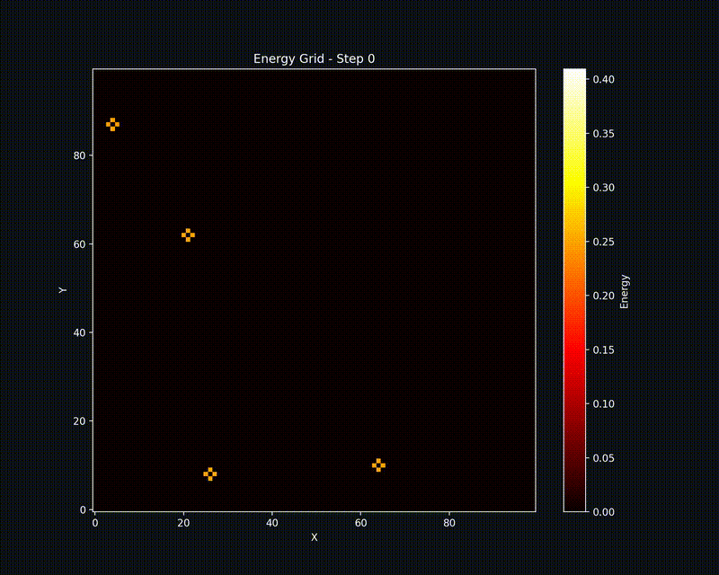

    <h1>Distributed Stencil Performance Analysis</h1>
    <h3>Author: Christian Faccio</h3>
    <h5>Email: christianfaccio@outlook.it</h4>
    <h5>Github: <a href="https://github.com/christianfaccio" target="_blank">christianfaccio</a></h5>
    <h6>This project aims at analyzing the performance of distributed stencil computations in a high-performance computing environment. Starting from a serial code implementation of the problem, a mixed approach using MPI and OpenMP is employed to evaluate the benefits of parallelism.</h6>

---

