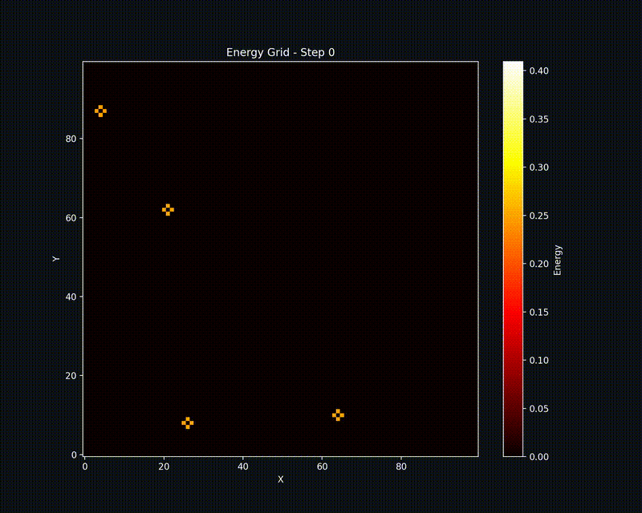

<div align="center">
    <h1>Distributed Stencil Performance Analysis</h1>
    <h3>Author: Christian Faccio</h3>
    <h5>Email: christianfaccio@outlook.it</h4>
    <h5>Github: <a href="https://github.com/christianfaccio" target="_blank">christianfaccio</a></h5>
    <h6>This project aims at analyzing the performance of distributed stencil computations in a high-performance computing environment. Starting from a serial code implementation of the problem, a mixed approach using MPI and OpenMP is employed to evaluate the benefits of parallelism.</h6>
</div>

---

<div align="center">
   
</div>

## Project Structure

```
.
├── assignment.pdf          # Project assignment
├── include                 # Header files
│   ├── parallel.h
│   └── serial.h
├── Makefile                # Makefile to build the project
├── output                  # Output files (.out from Leonardo)
│   ├── strong_scaling
│   ├── threads_scaling
│   └── weak_scaling
├── plots                   # Plots generated from the output data  
├── python                  # Python scripts for data analysis and visualization  
│   ├── parse_results.py
│   ├── plot_results.py
│   └── visualize_grid.py
├── README.md               # Project documentation
├── results                 # Results of the experiments (.csv files)
├── requirements.txt        # Project dependencies
├── scripts                 # Scripts for running experiments on Leaonardo
└── src                     # Source code files
    ├── parallel.c
    └── serial.c
```

## How to build and run

First of all, clone the repository:

```bash
git clone git@github.com:christianfaccio/stencil_method.git
```

(eventually) create and activate a virtual environment:

```bash
uv venv stencil
source stencil/bin/activate
uv pip install -r requirements.txt
```

Then, build and run the project using the provided Makefile:
```
make serial <args>   # For the serial version
make parallel <args> # For the parallel version
```

To clean the build files, use:
```
make clean_all
```

## Leonardo Cluster

This project is designed to be used on a high-performance computing cluster, such that an analysis of the performance of the parallel implementation can be conducted. The cluster used for this project is Leonardo, specifically the DCGP partition.

Each DCGP node features:

- 2x Intel(R) Xeon(R) Platinum 8480+ CPUs
- 112 physical cores in total (56 per socket)
- Hyper-Threading disabled (1 thread per core)
- A complex NUMA architecture with 8 nodes.

For everyday login, use the following command:

```
step ssh login '<email>' --provisioner cineca-hpc # login

ssh <username>@login.leonardo.cineca.it
```

if a warning (`WARNING: REMOTE HOST IDENTIFICATION HAS CHANGED!`) appears, just run the following command and login:
```
ssh-keygen -f ~/.ssh/known_hosts -R login.leonardo.cineca.it; for keyal in ssh-rsa ecdsa-sha2-nistp256; do for address in login01-ext.leonardo.cineca.it login02-ext.leonardo.cineca.it login05-ext.leonardo.cineca.it login07-ext.leonardo.cineca.it; do ssh-keyscan -t  ${keyal} ${address} | sed "s/\b${address}/login*.leonardo.cineca.it/g" >> ~/.ssh/known_hosts; done; done
ssh <username>@login.leonardo.cineca.it
```

`saldo -b --dcgp` tells how many core-hours (budget) is left for the **group**.

To share file TO/FROM local machine and Leonardo, I used the `scp` command via datamovers:

```
scp path/to/local/file <username>@data.leonardo.cineca.it:/leonardo/home/<username>
scp <username>@data.leonardo.cineca.it:/leonardo/home/<username>/path/to/remote/file path/to/local/
```

Finally, to submit jobs to the DCGP partition, use the `sbatch` command:

```
# Assure no modules
module purge
# Load openmpi module (leonardo)
module load openmpi/4.1.6--gcc--12.2.0
# Compile
scripts/compile.sh

# Submit job
sbatch scripts/threads_scaling.sh
sbatch scripts/strong_scaling.sh
sbatch scripts/weak_scaling.sh
```

> [!WARNING]
> The `go_dcgp.sbatch` script is used internally by the other .sh scripts so don't use it directly (at least for this project).

## Choices made